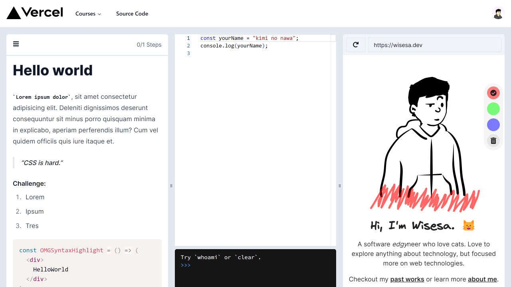

<p align="center">
  
</p>

# W-Academy

Just another my ~~unfinihsed~~ side project

<p align="center">
  
</p>

## Run Locally

### Prerequisite

- [Node.js](https://nodejs.org/)
- [pnpm](https://pnpm.io/installation)

```bash
pnpm dev
```

Open [http://localhost:3000](http://localhost:3000) with your browser to see the result.

## Run using Docker

1. [Install Docker](https://docs.docker.com/get-docker/) on your machine.
1. Build your container: `docker build -t nextjs-docker .`.
1. Run your container: `docker run -p 3000:3000 nextjs-docker`.

## Built Using

- [Next.JS](https://nextjs.org/)
- [Tailwindcss](https://tailwindcss.com/)🎨
- [shacdn/ui](https://ui.shadcn.com/)🖌️
- [@serwist/next](https://serwist.pages.dev/) ⚙️ service worker
- Written in [typescript](https://typescriptlang.org)
- [Hosted on Vercel 🚀](https://vercel.com/)
